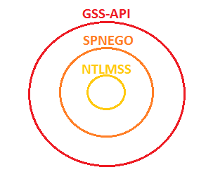
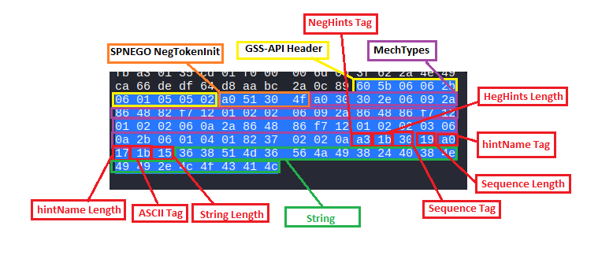
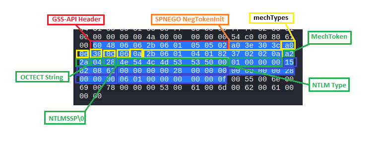
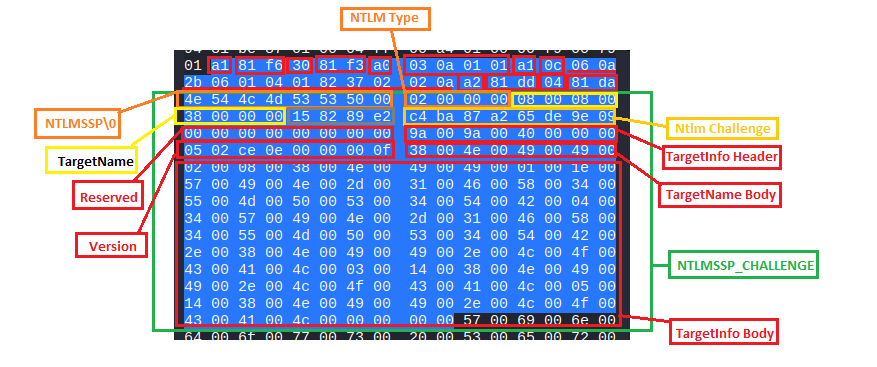
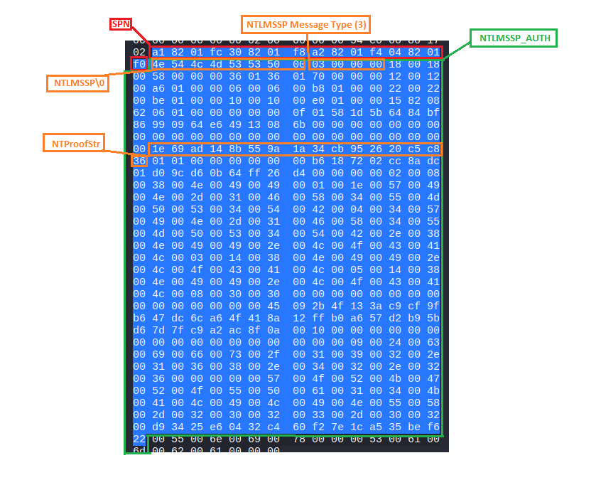

# SPNEGO & NTLMSSP over SMB: A Deep Dive

This document analyzes in detail how authentication protocols are encapsulated within SMB messages. Specifically, we explore the layered architecture composed of **GSSAPI**, **SPNEGO**, and **NTLMSSP**, analyzing the bytes of the Security Blobs exchanged between client and server.


## 1. The Context: GSSAPI and SPNEGO

When an SMB client and server communicate for the first time, they must decide how to authenticate. The problem is that the client might support both Kerberos and NTLM, while the server only supports NTLM. How do they agree without reinventing the wheel every time?

This is where GSSAPI and SPNEGO come into play.

### What is GSSAPI?

**GSSAPI** (Generic Security Service Application Program Interface - RFC 2743) is not a security protocol itself, but a **standard interface** (a framework). It allows applications (like SMB, HTTP, or SSH) to handle security without needing to know the intimate details of Kerberos or NTLM. GSSAPI provides the standardized "envelope" (the *wrapper*) in which to place security messages.

### What is SPNEGO?
**SPNEGO** (Simple and Protected GSSAPI Negotiation Mechanism - RFC 4178) is a mechanism that "pretends" to be an authentication protocol in the eyes of GSSAPI (it is a "pseudo-mechanism"). Its only real function is to allow the client and server to securely **negotiate** which real authentication protocol to use (e.g., NTLM or Kerberos).

### The Onion Model



To understand the bytes traveling over the network, you have to imagine the security packet (Security Blob) as a matryoshka doll or an onion composed of three main layers:

1. **The GSSAPI "Envelope" (Initial Token):** Uses a standardized **ASN.1 DER** encoding (Big-Endian / Network Byte Order). It serves to tell the application: *"Attention, this is a negotiation token"*.
2. **The SPNEGO Container (`negTokenInit` / `negTokenResp`):** Also encoded in **ASN.1 DER**. It contains the list of supported protocols (OIDs) and the state of the negotiation.
3. **The Payload (Payload of the chosen protocol, e.g., NTLMSSP):** Here, ASN.1 "dies". The payload is encapsulated inside an ASN.1 *Octet String* (`0x04`) tag. From this byte onward, the rules change, and we switch to the specific formatting of the chosen protocol. In the case of **NTLMSSP**, it switches to **Little-Endian**.


## 2. SPNEGO Negotiation Phases

According to [RFC 4178](https://datatracker.ietf.org/doc/html/rfc4178), the SPNEGO layer uses two main types of tokens:

### `NegTokenInit` (Tag `0xa0`)
Sent by the client (or by the server to propose mechanisms) to initiate the negotiation.
* **`mechTypes`:** OIDs of the available security mechanisms, in decreasing order of preference.
* **`reqFlags`:** Context flags (e.g., delegation, mutual authentication).
* **`mechToken`:** The "optimistic" mechanism token (e.g., the first NTLM packet, if the client is confident the server will accept it).
* **`mechListMIC`:** A MIC token to ensure message integrity.

### `NegTokenResp` (Tag `0xa1`)
Sent to respond to a `NegTokenInit` or to continue subsequent exchanges.
* **`negState`:** The state of the negotiation (`accept-completed`, `accept-incomplete`, `reject`, `request-mic`).
* **`supportedMech`:** (Only in the first response) The protocol chosen by the target.
* **`responseToken`:** The actual payload of the chosen protocol (e.g., the NTLM Challenge).


## 3. SMB / NTLM Packet Analysis

The tags `0xa0`, `0xa1`, etc., in ASN.1 DER are **positional**, meaning their significance depends on where they are nested.

### Phase 1: SMB_COM_NEGOTIATE Response
The `SecurityBlob` in this response is the first step. The format strictly follows ASN.1 DER.

**GSS-API Header:**
* `0x60`: Application Tag (Indicates an initial GSS-API token).
* `0xXX`: Length. 
  * *Short Form (1 byte):* If < 128 bytes. (E.g., 72 bytes → `0x48`).
  * *Long Form (2+ bytes):* If >= 128 bytes. The most significant bit of the first byte is set to 1, and the remaining 7 bits indicate how many bytes follow to form the length (E.g., `0x81 0x96` = 150 bytes; `0x82 0x01 0x2C` = 300 bytes).
* `0x06 0x06 0x2b 0x06 0x01 0x05 0x05 0x02`: SPNEGO OID (1.3.6.1.5.5.2). 
  * `0x06`: "Object Identifier" Tag.
  * `0x06`: Length.
  * Value: SPNEGO Identifier.

**SPNEGO NegTokenInit (`0xa0`):**
* `0xa0`: Tag for `negTokenInit`.
* `0xXX`: Length.
* `0x30`: Sequence Tag (ordered list of elements).

**MechTypes (List of chosen OIDs):**
* `0xa0`: MechTypes Tag.
* `0xXX`: Total length.
* `0x30`: Sequence Tag.
* `0x06`: OID Tag (e.g., NTLMSSP).

**NegHints (Microsoft Integration):**
* `0xa3`: Start of `negHints`.
* `0xa0`: Start of `hintName`.
* `0x1b`: ASCII string tag followed by the string value.



### Phase 2: SMB_COM_SESSION_SETUP_ANDX Request (NTLMSSP_NEGOTIATE)
The client responds with its mechanisms and includes the first NTLM payload ("optimistic token").

**GSS-API & SPNEGO (`0xa0`):** Similar to Phase 1, but `mechTypes` contains only the chosen OID.

**mechToken (The NTLM Payload):**
* `0xa2`: Tag for `mechToken`.
* `0xXX`: Length.
* `0x04`: Standard ASN.1 tag for **OCTET STRING**. (Here ASN.1 ends).
* `0xXX`: Length.
* `0x4e 0x54 0x4c 0x4d 0x53 0x53 0x50 0x00`: ("NTLMSSP\0"). Start of NTLM Type 1 packet (Little-Endian) [[MS-NLMP]](https://learn.microsoft.com/en-us/openspecs/windows_protocols/ms-nlmp/b34032e5-3aae-4bc6-84c3-c6d80eadf7f2).
  * **Message Type:** NTLMSSP_NEGOTIATE (`0x01 0x00 0x00 0x00`).
  * **Flags:** 4 bytes (e.g., `0x15 0x82 0x08 0x62`).
  * **WorkStation domain & name:** Header format (2 bytes length, 2 bytes maxlen, 4 bytes offset).



### Phase 3: SMB_COM_SESSION_SETUP_ANDX Response (NTLMSSP_CHALLENGE)
The server sends the cryptographic "challenge". We no longer use `negTokenInit` (`0xa0`), but **`negTokenResp` (`0xa1`)**. The GSS-API header (`0x60`) disappears because the context has already been established.

**SPNEGO Structure:**
* `0xa1`: `negTokenResp` Tag.
* `0x30`: Sequence.
* `0xa0` -> `0x03 0x0a 0x01 0x01`: `negState` set to `accept-incomplete` (authentication continues).
* `0xa1`: `supportedMech` (Confirms the NTLMSSP OID).
* `0xa2`: `responseToken` (NTLM packet container).
* `0x04`: OCTET STRING (End of ASN.1).

**Payload NTLMSSP_CHALLENGE (NTLM Type 2) [[MS-NLMP]](https://learn.microsoft.com/en-us/openspecs/windows_protocols/ms-nlmp/801a4681-8809-4be9-ab0d-61dcfe762786):**
* `0x4e 0x54...`: "NTLMSSP\0".
* `0x02 0x00 0x00 0x00`: Message Type (NTLMSSP_CHALLENGE).
* **Target Name:** Standard header (Len, MaxLen, Offset).
* **NTLM Challenge:** 8 bytes (e.g., `0xc4 0xba 0x87 0xa2 0x65 0xde 0x9e 0x09`).
* **Target Info:** Points to the data block at the end of the packet containing server info (e.g., `WIN-1FX4UMPS4TB`).




### Phase 4: SMB_COM_SESSION_SETUP_ANDX Request (NTLMSSP_AUTH)
The client responds to the challenge proving it knows the password.


**SPNEGO Structure:**
* `0xa1`: `negTokenResp` Tag.
* `0x30`: Sequence.
* `0xa2`: `responseToken`.
* `0x04`: OCTET STRING (End of ASN.1).

**Payload NTLMSSP_AUTH (NTLM Type 3) [[MS-NLMP]](https://learn.microsoft.com/en-us/openspecs/windows_protocols/ms-nlmp/033d32cc-88f9-4483-9bf2-b273055038ce):**
* `0x4e 0x54...`: "NTLMSSP\0".
* `0x03 0x00 0x00 0x00`: Message Type (NTLMSSP_AUTH).
* **Multiple Headers:** (Len, MaxLen, Offset) for LM Response, NTLM Response, Domain Name, UserName, Hostname, Session Key.
* **NTProofStr:** The cryptographic hash calculated on the challenge (16 bytes).
* **MIC (Message Integrity Code):** 16 bytes for the validation of the entire exchange.
* **Field Bodies:** At the bottom of the packet are the actual strings (usernames, domains, etc.) at their respective previously calculated offsets.



## Usage

Below is a complete C example demonstrating how to initialize the library, set up a custom logging callback, and parse an NTLM message buffer. 

In this example, we define buffers for NEGOTIATE, CHALLENGE, and AUTHENTICATE messages, but we will focus on parsing the final `ntlm_authenticate` (Type 3) payload.

```c
#include <stdio.h>
#include <stdint.h>
#include <stdarg.h>

#include "ntlm_parser.h"

// Define a custom logger callback function
void custom_logger(const char *format, va_list args) {
    vprintf(format, args);
}

int main(void) {
    // Register the custom logger with the NTLM parser
    set_ntlm_logger(custom_logger);
    
    // NTLMSSP_NEGOTIATE (Type 1)
    const uint8_t ntlm_negotiate[] = {
        0x4e, 0x54, 0x4c, 0x4d, 0x53, 0x53, 0x50, 0x00, 
        0x01, 0x00, 0x00, 0x00, 0x15, 0x82, 0x08, 0x62,
        0x00, 0x00, 0x00, 0x00, 0x28, 0x00, 0x00, 0x00, 
        0x00, 0x00, 0x00, 0x00, 0x28, 0x00, 0x00, 0x00,
        0x06, 0x01, 0x00, 0x00, 0x00, 0x00, 0x00, 0x0f
    };
    
    // NTLMSSP_CHALLENGE (Type 2)
    const uint8_t ntlm_challenge[] = {
        0x4e, 0x54, 0x4c, 0x4d, 0x53, 0x53, 0x50, 0x00, 
        0x02, 0x00, 0x00, 0x00, 0x08, 0x00, 0x08, 0x00,
        0x38, 0x00, 0x00, 0x00, 0x15, 0x82, 0x89, 0xe2, 
        0xc4, 0xba, 0x87, 0xa2, 0x65, 0xde, 0x9e, 0x09,
        0x00, 0x00, 0x00, 0x00, 0x00, 0x00, 0x00, 0x00, 
        0x9a, 0x00, 0x9a, 0x00, 0x40, 0x00, 0x00, 0x00,
        0x05, 0x02, 0xce, 0x0e, 0x00, 0x00, 0x00, 0x0f, 
        0x38, 0x00, 0x4e, 0x00, 0x49, 0x00, 0x49, 0x00,
        0x02, 0x00, 0x08, 0x00, 0x38, 0x00, 0x4e, 0x00, 
        0x49, 0x00, 0x49, 0x00, 0x01, 0x00, 0x1e, 0x00,
        0x57, 0x00, 0x49, 0x00, 0x4e, 0x00, 0x2d, 0x00, 
        0x31, 0x00, 0x46, 0x00, 0x58, 0x00, 0x34, 0x00,
        0x55, 0x00, 0x4d, 0x00, 0x50, 0x00, 0x53, 0x00, 
        0x34, 0x00, 0x54, 0x00, 0x42, 0x00, 0x04, 0x00,
        0x34, 0x00, 0x57, 0x00, 0x49, 0x00, 0x4e, 0x00, 
        0x2d, 0x00, 0x31, 0x00, 0x46, 0x00, 0x58, 0x00,
        0x34, 0x00, 0x55, 0x00, 0x4d, 0x00, 0x50, 0x00, 
        0x53, 0x00, 0x34, 0x00, 0x54, 0x00, 0x42, 0x00,
        0x2e, 0x00, 0x38, 0x00, 0x4e, 0x00, 0x49, 0x00, 
        0x49, 0x00, 0x2e, 0x00, 0x4c, 0x00, 0x4f, 0x00,
        0x43, 0x00, 0x41, 0x00, 0x4c, 0x00, 0x03, 0x00, 
        0x14, 0x00, 0x38, 0x00, 0x4e, 0x00, 0x49, 0x00,
        0x49, 0x00, 0x2e, 0x00, 0x4c, 0x00, 0x4f, 0x00, 
        0x43, 0x00, 0x41, 0x00, 0x4c, 0x00, 0x05, 0x00,
        0x14, 0x00, 0x38, 0x00, 0x4e, 0x00, 0x49, 0x00, 
        0x49, 0x00, 0x2e, 0x00, 0x4c, 0x00, 0x4f, 0x00,
        0x43, 0x00, 0x41, 0x00, 0x4c, 0x00, 0x00, 0x00, 
        0x00, 0x00
    };

    // NTLMSSP_AUTH (Type 3)
    const uint8_t ntlm_authenticate[] = {
        0x4e, 0x54, 0x4c, 0x4d, 0x53, 0x53, 0x50, 0x00, 
        0x03, 0x00, 0x00, 0x00, 0x18, 0x00, 0x18, 0x00,
        0x58, 0x00, 0x00, 0x00, 0x36, 0x01, 0x36, 0x01, 
        0x70, 0x00, 0x00, 0x00, 0x12, 0x00, 0x12, 0x00,
        0xa6, 0x01, 0x00, 0x00, 0x06, 0x00, 0x06, 0x00, 
        0xb8, 0x01, 0x00, 0x00, 0x22, 0x00, 0x22, 0x00,
        0xbe, 0x01, 0x00, 0x00, 0x10, 0x00, 0x10, 0x00, 
        0xe0, 0x01, 0x00, 0x00, 0x15, 0x82, 0x08, 0x62,
        0x06, 0x01, 0x00, 0x00, 0x00, 0x00, 0x00, 0x0f, 
        0x01, 0x58, 0x1d, 0x5b, 0x64, 0x84, 0xbf, 0x86,
        0x99, 0x09, 0x64, 0xe6, 0x49, 0x13, 0x08, 0x6b, 
        0x00, 0x00, 0x00, 0x00, 0x00, 0x00, 0x00, 0x00,
        0x00, 0x00, 0x00, 0x00, 0x00, 0x00, 0x00, 0x00, 
        0x00, 0x00, 0x00, 0x00, 0x00, 0x00, 0x00, 0x00,
        0x1e, 0x69, 0xad, 0x14, 0x8b, 0x55, 0x9a, 0x1a, 
        0x34, 0xcb, 0x95, 0x26, 0x20, 0xc5, 0xc8, 0x36,
        0x01, 0x01, 0x00, 0x00, 0x00, 0x00, 0x00, 0x00, 
        0xb6, 0x18, 0x72, 0x02, 0xcc, 0x8a, 0xdc, 0x01,
        0xd0, 0x9c, 0xd6, 0x0b, 0x64, 0xff, 0x26, 0xd4, 
        0x00, 0x00, 0x00, 0x00, 0x02, 0x00, 0x08, 0x00,
        0x38, 0x00, 0x4e, 0x00, 0x49, 0x00, 0x49, 0x00, 
        0x01, 0x00, 0x1e, 0x00, 0x57, 0x00, 0x49, 0x00,
        0x4e, 0x00, 0x2d, 0x00, 0x31, 0x00, 0x46, 0x00, 
        0x58, 0x00, 0x34, 0x00, 0x55, 0x00, 0x4d, 0x00,
        0x50, 0x00, 0x53, 0x00, 0x34, 0x00, 0x54, 0x00, 
        0x42, 0x00, 0x04, 0x00, 0x34, 0x00, 0x57, 0x00,
        0x49, 0x00, 0x4e, 0x00, 0x2d, 0x00, 0x31, 0x00, 
        0x46, 0x00, 0x58, 0x00, 0x34, 0x00, 0x55, 0x00,
        0x4d, 0x00, 0x50, 0x00, 0x53, 0x00, 0x34, 0x00, 
        0x54, 0x00, 0x42, 0x00, 0x2e, 0x00, 0x38, 0x00,
        0x4e, 0x00, 0x49, 0x00, 0x49, 0x00, 0x2e, 0x00, 
        0x4c, 0x00, 0x4f, 0x00, 0x43, 0x00, 0x41, 0x00,
        0x4c, 0x00, 0x03, 0x00, 0x14, 0x00, 0x38, 0x00, 
        0x4e, 0x00, 0x49, 0x00, 0x49, 0x00, 0x2e, 0x00,
        0x4c, 0x00, 0x4f, 0x00, 0x43, 0x00, 0x41, 0x00, 
        0x4c, 0x00, 0x05, 0x00, 0x14, 0x00, 0x38, 0x00,
        0x4e, 0x00, 0x49, 0x00, 0x49, 0x00, 0x2e, 0x00, 
        0x4c, 0x00, 0x4f, 0x00, 0x43, 0x00, 0x41, 0x00,
        0x4c, 0x00, 0x08, 0x00, 0x30, 0x00, 0x30, 0x00, 
        0x00, 0x00, 0x00, 0x00, 0x00, 0x00, 0x00, 0x00,
        0x00, 0x00, 0x00, 0x00, 0x00, 0x00, 0x45, 0x09, 
        0x2b, 0x4f, 0x13, 0x3a, 0xc9, 0xcf, 0x9f, 0xb6,
        0x47, 0xdc, 0x6c, 0xa6, 0x4f, 0x41, 0x8a, 0x12, 
        0xff, 0xb0, 0xa6, 0x57, 0xd2, 0xb9, 0x5b, 0xd6,
        0x7d, 0x7f, 0xc9, 0xa2, 0xac, 0x8f, 0x0a, 0x00, 
        0x10, 0x00, 0x00, 0x00, 0x00, 0x00, 0x00, 0x00,
        0x00, 0x00, 0x00, 0x00, 0x00, 0x00, 0x00, 0x00, 
        0x00, 0x00, 0x09, 0x00, 0x24, 0x00, 0x63, 0x00,
        0x69, 0x00, 0x66, 0x00, 0x73, 0x00, 0x2f, 0x00, 
        0x31, 0x00, 0x39, 0x00, 0x32, 0x00, 0x2e, 0x00,
        0x31, 0x00, 0x36, 0x00, 0x38, 0x00, 0x2e, 0x00, 
        0x34, 0x00, 0x32, 0x00, 0x2e, 0x00, 0x32, 0x00,
        0x36, 0x00, 0x00, 0x00, 0x00, 0x00, 0x57, 0x00, 
        0x4f, 0x00, 0x52, 0x00, 0x4b, 0x00, 0x47, 0x00,
        0x52, 0x00, 0x4f, 0x00, 0x55, 0x00, 0x50, 0x00, 
        0x61, 0x00, 0x31, 0x00, 0x34, 0x00, 0x4b, 0x00,
        0x41, 0x00, 0x4c, 0x00, 0x49, 0x00, 0x4c, 0x00, 
        0x49, 0x00, 0x4e, 0x00, 0x55, 0x00, 0x58, 0x00,
        0x2d, 0x00, 0x32, 0x00, 0x30, 0x00, 0x32, 0x00, 
        0x33, 0x00, 0x2d, 0x00, 0x30, 0x00, 0x32, 0x00,
        0xd9, 0x34, 0x25, 0xe6, 0x04, 0x32, 0xc4, 0x60, 
        0xf2, 0x7e, 0x1c, 0xa5, 0x35, 0xbe, 0xf6, 0x22
    };

    ntlm_msg_t msg;
    ntlm_parser_error res;
    ntlm_buffer_ctx_t ctx_buffer;

    // Initialize the buffer context.
    // We use sizeof() instead of a hardcoded length for safety.
    size_t auth_len = sizeof(ntlm_authenticate);
    res = ntlm_ctx_buffer_init(ntlm_authenticate, auth_len, &ctx_buffer);

    if (res < NTLM_PARSER_OK) {
        printf("Buffer Init Error: 0x%x\n", res);
        return 1;
    }

    // Parse the NTLM message
    res = parse_ntlm_msg(&ctx_buffer, &msg);

    if (res < NTLM_PARSER_OK) {
        printf("Parse Error: 0x%x\n", res);
        return 1;
    }

    // Dump the parsed structure
    res = dump_msg(&msg);
    if (res < NTLM_PARSER_OK) {
        printf("Dump Error: 0x%x\n", res);
        free_ntlm_msg(&msg); // Free memory before returning on error
        return 1;
    }

    printf("\n[+] NTLM structure parsed successfully!\n");

    // Free allocated memory
    free_ntlm_msg(&msg);

    return 0;
}
```

### Compilation

Assuming your source code is named `main.c` and your parser implementation is in `ntlm_parser.c`:

```bash
gcc main.c ntlm_parser.c -o ntlm_example
```

### Execution

```bash
./ntlm_example
```

### Result Example

```
TLM Message Type: 3
Header Field LmChallengeResponseFields:
  len: 24
  max_len: 24
  buffer_offset: 88
Header Field NtChallengeResponseFields:
  len: 310
  max_len: 310
  buffer_offset: 112
Header Field DomainNameFields:
  len: 18
  max_len: 18
  buffer_offset: 422
Header Field UserNameFields:
  len: 6
  max_len: 6
  buffer_offset: 440
Header Field WorkstationFields:
  len: 34
  max_len: 34
  buffer_offset: 446
Header Field EncryptedRandomSessionKeyFields:
  len: 16
  max_len: 16
  buffer_offset: 480
NtChallengeResponse (NTLM_V2):
AV Pairs [8]:
  AV ID: 0x0002, Len: 8, Value: 8NII
  AV ID: 0x0001, Len: 30, Value: WIN-1FX4UMPS4TB
  AV ID: 0x0004, Len: 52, Value: WIN-1FX4UMPS4TB.8NII.LOCAL
  AV ID: 0x0003, Len: 20, Value: 8NII.LOCAL
  AV ID: 0x0005, Len: 20, Value: 8NII.LOCAL
  AV ID: 0x0008, Len: 48, Value: 30 00 00 00 00 00 00 00 00 00 00 00 00 00 00 00 45 09 2b 4f 13 3a c9 cf 9f b6 47 dc 6c a6 4f 41 8a 12 ff b0 a6 57 d2 b9 5b d6 7d 7f c9 a2 ac 8f 
  AV ID: 0x000a, Len: 16, Value: 00 00 00 00 00 00 00 00 00 00 00 00 00 00 00 00 
  AV ID: 0x0009, Len: 36, Value: cifs/192.168.42.26
DomainName: WORKGROUP
UserName: a14
Workstation: KALILINUX-2023-02
```